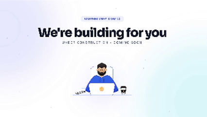

# 🛠️ Under Construction / Coming Soon Page

# Note:
>This project is Free to Use. If you like it, feel free to give it a ***⭐*** ! and use it for free ..

A clean, modern, and highly responsive "Under Construction" landing page. Featuring smooth SVG animations, glassmorphism UI elements, and a professional aesthetic to keep your audience engaged while you build.

---

## 📸 Preview
> Actual template is a lot smoother than this.  

  
 </a>

---

## ✨ Features

* **Smooth SVG Animations:** Rotating gears and a "floating" worker illustration for a dynamic feel.
* **Modern UI:** Built with Inter & Sora typography and a soft Glassmorphism status badge.
* **Fully Responsive:** Optimized for desktops, tablets, and mobile devices.
* **Lightweight:** Zero dependencies. Just pure HTML and CSS.
* **SEO Ready:** Includes meta tags and structured semantic HTML.

## 📜 License
This project is licensed under the MIT License - see the LICENSE file for details.

## 👤 Credits
Made with ❤️ and by the Xhorizon Team

This project is Free to Use. If you like it, feel free to give it a ***⭐***!
